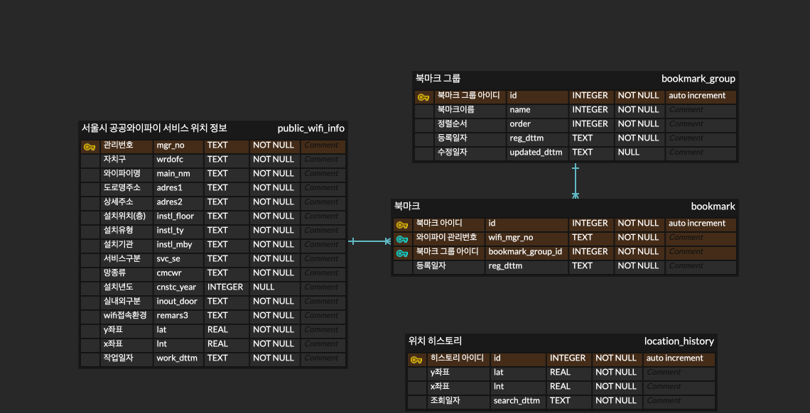

## ERD
https://www.erdcloud.com/d/FqkSxPehYe835CBhg


## DDL
```SQL
create table bookmark_group
(
    id           INTEGER not null
        constraint bookmark_group_pk
            primary key autoincrement,
    name         TEXT    not null,
    "order"      INTEGER not null,
    reg_dttm     TEXT    not null,
    updated_dttm TEXT
);

create table location_history
(
    id          INTEGER        not null
        constraint location_history_pk
            primary key autoincrement,
    lat         REAL default 0 not null,
    lnt         REAL default 0 not null,
    search_dttm TEXT           not null
);

create table public_wifi_info
(
    mgr_no      TEXT not null
        constraint public_wifi_info_pk
            primary key,
    wrdofc      TEXT not null,
    main_nm     TEXT not null,
    adres1      TEXT not null,
    adres2      TEXT not null,
    instl_floor TEXT not null,
    instl_ty    TEXT not null,
    instl_mby   TEXT not null,
    svc_se      TEXT not null,
    cmcwr       TEXT not null,
    cnstc_year  TEXT not null,
    inout_door  TEXT not null,
    remars3     TEXT not null,
    lat         REAL not null,
    lnt         REAL not null,
    work_dttm   TEXT not null
);

create table bookmark
(
    id                INTEGER not null
        constraint bookmark_pk
            primary key autoincrement,
    bookmark_group_id INTEGER not null
        constraint bookmark_bookmark_group_id_fk
            references bookmark_group
            on delete cascade,
    wifi_mgr_no       TEXT    not null
        constraint bookmark_public_wifi_info_mgr_no_fk
            references public_wifi_info
            on delete cascade,
    reg_dttm          TEXT    not null,
    constraint bookmark_pk2
        unique (wifi_mgr_no, bookmark_group_id)
);


```